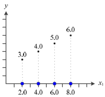
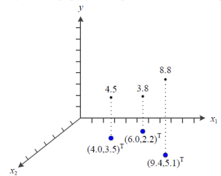

# 1.2 특징공간에 대한 이해

### 특징 공간이란?

- 관측값들이 있는 공간
- 즉 모델의 입력으로 들어올수 있는 모든 경우의 수 집합

# 1.2.1 1차원과 2차원 특징 공간

### 1차원 특징공간

- 입력 데이터 : $x1$
- 출력 데이터 : $y$

### 2차원 특징공간

- 특징 벡터
  - $x=(x1,x2)^T$
  - 관측값, 기계학습의 모델의 입력
- 예측값
  - $y$
  - 예측값, 관측값에 따른 결과
- 예시
  - $x=(몸무게, 키)^T\\y=장타율$

# 1.2.2 다차원 특징공간

- d차원 특징벡터
  - $x=(x1, x2, ... , xd)^T$
- 학습모델에 따른 매개변수
  - 직선 모델
    - $y=w_1x_1 + w_2x_2 + ... + w_dx_d + b$
    - 매개변수  $w_1$~$w_d, b$ 까지 총 $d+1$ 개 
  - 2차 곡선 모델
    - 매개변수 $d^2+d+1$개

# 1.2.3 특징 공간 변환과 표현 학습

## 특징공간 변환

- 선형분리가 불가능한 특징 공간을 임의로 변환 후 선형 분리 하는것
- 특징 벡터들에 대해 좌표변환을 거쳐 특징공간을 변환한다

+ 예시

  - 그림 a에서는 직선으로만 그리면 최대 75% 정확률이 한계임
  - 특징공간 변환 → d를 d’으로 옮김, 그리고 c’과 b’의 y좌표를 위로 옮겨줌
  - 특징공간 변환을 하면, 새로운 특징 공간이 도출되고 직선모델로 100% 정확률을 가질 수 있음

&nbsp;&nbsp;&nbsp;&nbsp;&nbsp;&nbsp;&nbsp;&nbsp;&nbsp;&nbsp;

## 표현학습

- 좋은 특징공간으로 변환을 찾는 작업
- 딥러닝도 표현학습에 포함
  - 딥러닝은 다수의 은닉층을 가진 신경망을 이용하여 계층적인 특징공간을 찾아내기 때문
  - x → 층1 → 층2 → 층3 → … → y 이러한 구조에서 자동으로 표현학습이 발생함
  - 왼쪽 은닉층 : 저급특징(에지, 구석점 등) 추출(Local feature을 찾아냄)
  - 오른쪽 은닉층 : 고급특징(얼굴, 바퀴 등) 추출(global feature을 찾아냄)

## 차원에 대한 설명
- 차원에 무관하게 수식이 성립함
  - ex) 두점 사이의 거리 
    - $dist(a,b) = \sqrt{\sum_{i=1}^{d} (a_i-b_i)^2}$
    - 두 벡터 사이의 거리는 모든 차원에서 위 식이 성립
  - 하위 차원에서 식을 새워 상위 차원에 적용할 수 있다.
- 차원의 저주
  - 특징공간의 차원이 높아질수록 기하급수적으로 특징공간에서 훈련 샘플이 차지하는 비중이 작아진다.
  - 즉 전체 경우의 수에 비해 샘플의 크기가 너무 작아진다